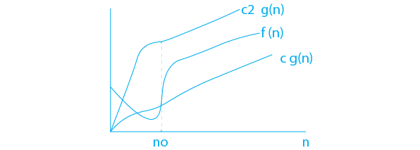
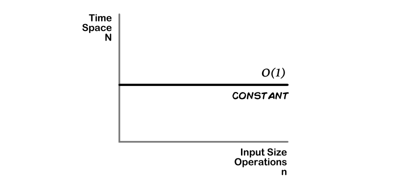
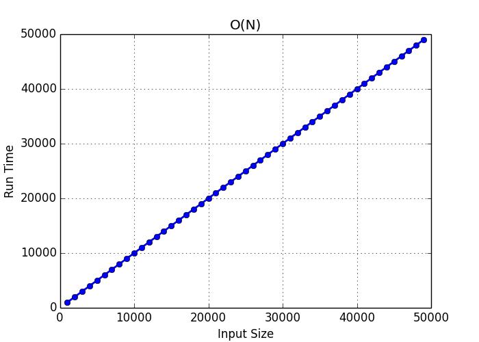
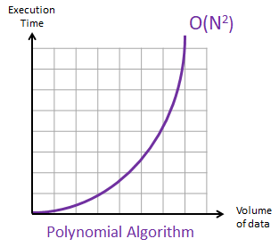

# INTRODUCTION TO ➡  DATA STRUCTURES 📊
 
### What are Data Structures? 🤔
A specialized format for organizing, processing, 
retrieving and storing data.

### Why we need Data Structures
After organizing data, it becomes easy to process it.
It is akin to searching for your clothing within an unorganized room, 
a process that consumes considerable time and energy, ultimately leading to frustration. 
Therefore, it is advisable to organize your living space for a quick and efficient retrieval of items.
An important consideration is that this approach minimizes energy expenditure.

### Type of Data Structures 

  Data Structures 

### Algorithms

An Algorithm is a set of instructions to perform a task or to solve a given problem, 
for example

### Analysis of Algorithms
Analysis of algorithm deals with finding the best algorithm which runs 
fast and takes in less memory  

#### Time Complexity
It is the duration ⏱ taken by algorithm to run; the input processed by an 
algorithm helps to determine the time complexity \
Note 📝:   in java we can use the System.
CurrentTimeMille function to know the different of time of execution between tow algorithems
that's just to simplify the time complexity,
And there are specific mathematics tools to claclculate 🎰 the time complexity

#### Space Complexity
it is the amount of memory 💾 or space taken by algorithm to run 
the memory required to process the input by an algorithm helps in determining the space complexity 

### Asymptotic Analysis of an Algorithm
>**Asymptotic analysis is a mathematical technique**
>>*used for understanding the behavior of algorithms as their input increases. 
It uses asymptotic notations to describe the growth rate or time complexity of an algorithm, 
which allows us to compare different algorithms and understand how they perform in realistic scenarios.*

### Asymptotic Notation 
- Asymptotic notations are mathematical tools to express the time complexity of algorithms for asymptotic analysis.
- Asymptotic Notation is the mathematical tools used to describe the running time of an algorithm in terms of input size
- Asymptotic Notation is used to describe the running time of an algorithm—how much time an algorithm takes with a given input, n.
- Asymptotic Notations help us in determining:
- 1️⃣.**Best Case** − Minimum time for the execution.🟢
- 2️⃣.**Average Case** − Average time for the execution.🟠
- 3️⃣.**Worst Case** − Maximum time for the execution.🔴
**Note** 📝:  if there’s no input to the algorithm, Then it is considered to work in a constant time.
Other than the "input" all other factors are considered to be constant.

### Type of Asymptotic Notation 
There are three notations for performing runtime analysis of an algorithm
- Big (O) Notation 
- Theta (Θ) Notation  
- Omega (Ω) Notation
#### Omega (Ω)  Notation 

- it is A Formal way to express the lower bound of an algorithm's running time 
- Lower bound means for any given input this notation determines the best amount of time an algorithm can take to complete
- For example:  if We say certain algorithm takes 100 secs as the best amount of time,
  100 secs will be lower bound of that algorithm.
  The algorithm can take more than 100 secs but will not take less than 100 secs 
#### Big O(O) Notation

The Asymptotic Notation Ο(n) represents the upper bound of an algorithm’s running time.
It measures or calculates the worst-case time complexity or the maximum or longest amount of time an algorithm can possibly take to complete.
For example, O(log n) represents a binary search algorithm’s upper bound.
#### Rules of Big O(O) Notation 📍
- it's a Single Processor 
- it performs Sequential Execution of statements 
- Assignment operation takes one unit of Time 
- Return statement takes in one unit of time 
- Arithmetical operation and Logical Operation takes one unit of Time
- Other Small/single operations take one unit of time 
- Drop lower order terms: if n is huge we Drop lower order terms T=n²+3n+1====>O(n²)
- Drop constant multipliers T=3n²+6n+1 ====> O(n²)
#### Theta Asymptotic Notation, θ

The Theta Asymptotic Notation Ο(n) represents the both lower bound and upper bound of an algorithm’s running time. 
It measures the average case of time complexity. When we use big-Θ notation, 
we’re saying that we have an asymptotically tight bound on the running time.
#### Why are asymptotic notations important?
Asymptotic notations provide a standardized way to compare and analyze algorithms’ efficiency,
making it easier to assess their scalability and performance characteristics. 
They help us focus on the core trends in algorithm behavior as input sizes become large, 
which is essential for designing robust and efficient software.
### Calculating Time Complexity of Constant Algorithm 
If an algorithm's time complexity is constant, it means that it will always run in the same amount of time;
no matter the input size.For example, 
if we want to get the first item of an array,it doesn't matter how big the input size is.

 
in the First line we have four operations, so we have four Unite of Time 
and in the second line we have to operation, so it'd two unite of times  
T=4+2=6 ==> T=C(Constant)

In Complexity fo Constant Algorithm wherever the input size the Time complexity always still the O(1) 
  
            ┌————————————————————————————————————————————┐ 
            │ Line number  | operations  | unite of Time │   
            │------------- | ----------- | ------------- │ 
            │      2       |   1+1+1+1   |      4        │ 
            │ ------------ | ----------- | ------------- │
            │      3       |     1+1     |      2        │  
            │ ------------ | ----------- | ------------- │
            └————————————————————————————————————————————┘
            T=4+2=6
            T~(Constant)
            O(1)

### Calculating time Complexity of Linear Algorithm
An algorithm is said to have a linear time complexity when the running time increases linearly with the length of the input.
When the function involves checking all the values in input data, with this order O(n).
The above code shows that based on the length of the array (n), 
the run time will get linearly increased. 

     ┌————————————————————————————————————————————┐
     │ Line number  | operations  | unite of Time │   
     │------------- | ----------- | ------------- │
     │      29      |      1      |      1        │
     │ ------------ | ----------- | ------------- │
     │      30      |  1+3n+3+3n  |     6n+4      │  
     │ ------------ | ----------- | ------------- │
     │      31      | n(1+1+1+1)  |      4n       │
     │ ------------ | ----------- | ------------- │
     │      33      |     1+1     |      2        │     
     │ ------------ | ----------- | ------------- │
     └————————————————————————————————————————————┘

* 
 T=1+6n+4n+2 = 10n+7 in big O roles we have to ignore the constant 10 and lower Value 7 so O(n) 
 

Note 📝: \
time is proportional with the input size

### Calculating time Complexity of Polynomial Algorithm
Understanding Polynomial Time Complexity: Polynomial-time complexity is denoted by the "O(n^k)" notation,
where "n" represents the input size and "k" represents the degree of the polynomial.
In simpler terms, a polynomial time algorithm's runtime is directly proportional to some power of the input size \

| Line number | operations  | unite of Time |
| :---        |    :----:   |          ---: |
| Header      | Title       | Here's this   |
| Paragraph   | Text        | And more      |                
                                                        
                                                                 T=6n+4+6n²+4n+3n+n+1=9n²+11+5=O(n²)

 \
Note 📝;
that's why we shouldn't 🚨 have to use nested loop a lot in our program

# What is an Array? 🤔
An array is a collection of items of the same data type stored at contiguous memory locations, 
And the size of the array is immutable (Fixed) cannot be modified. 

